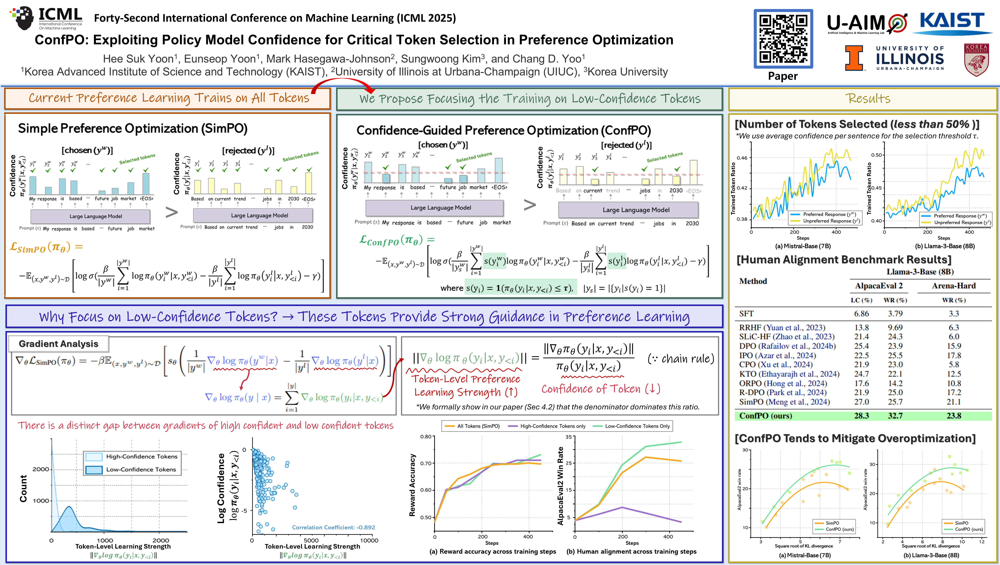

# ConfPO: Exploiting Policy Model Confidence for Critical Token Selection in Preference Optimization (ICML 2025)

This repository provides the official implementation of our ICML 2025 paper:
> ConfPO: Exploiting Policy Model Confidence for Critical Token Selection in Preference Optimization    
> Authors: Hee Suk Yoon, Eunseop Yoon, Mark Hasegawa-Johnson, Sungwoong Kim, Chang D. Yoo



## Installation
```bash
# Clone this repo
git clone https://github.com/hee-suk-yoon/ConfPO
cd ConfPo

# Create a conda enviroment
1. conda env create --name confpo python=3.11
2. conda activate confpo
3. pip install torch==2.4.0 torchvision==0.19.0 torchaudio==2.4.0 --index-url https://download.pytorch.org/whl/cu121
4. conda env update --file environment.yml --prune
```

## Running Experiments
1. SimPO (Baseline)
```bash
cd trl-main
bash commands/run_simpo.sh
```

2. ConfPO (Ours)
```bash
cd trl-main
bash commands/run_confpo.sh
```
## Acknowledgement
This work was supported by Artificial intelligence industrial convergence cluster development project funded by the Ministry of Science and ICT(MSIT, Korea)\&Gwangju Metropolitan City, Institute for Information \& communications Technology Planning \& Evaluation (IITP) grant funded by the Korea government(MSIT) (No.RS-2021-II211381, Development of Causal AI through Video Understanding and Reinforcement Learning, and Its Applications to Real Environments), and Institute of Information \& communications Technology Planning \& Evaluation (IITP) grant funded by the Korea government(MSIT) (No.RS-2022-II220184, Development and Study of AI Technologies to Inexpensively Conform to Evolving Policy on Ethics).

Also, we thank the authors of the [SimPO](https://github.com/princeton-nlp/SimPO) for their open-source contributions.

## Citation
If you find our work useful in your research, please cite:
```
@inproceedings{yoonconfpo,
  title={ConfPO: Exploiting Policy Model Confidence for Critical Token Selection in Preference Optimization},
  author={Yoon, Hee Suk and Yoon, Eunseop and Hasegawa-Johnson, Mark A and Kim, Sungwoong and Yoo, Chang D},
  booktitle={Forty-second International Conference on Machine Learning}
}
```

## Contact
If you have any questions, please feel free to email hskyoon@kaist.ac.kr
